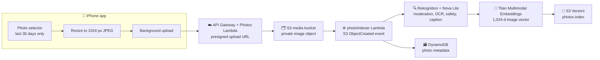
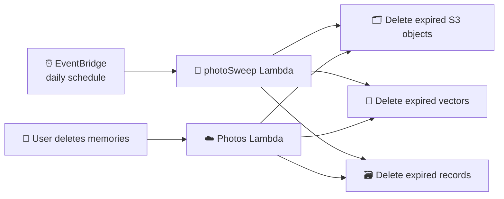

# Nudge architecture

This document maps the photo-memory pipeline and the services that support it.

## Tech stack

| Area | Technologies in use | Purpose |
| --- | --- | --- |
| iOS app | Swift 6, SwiftUI, iOS 18+ | Native product UI, onboarding, friends, nudges, calls, memories, and settings. |
| Apple frameworks | EventKit, Photos/PhotosUI, AVFoundation, BackgroundTasks, UserNotifications, PushKit, CallKit, Contacts, CoreMotion, Focus Status, AuthenticationServices, Keychain | Availability signals, 30-day photo selection, audio/video, background work, notifications, calling, contacts, driving/Focus awareness, Sign in with Apple, and secure token storage. |
| iOS packages | Amazon Chime SDK for iOS (0.27.4), PhoneNumberKit | 1:1 call/media and phone-number parsing. The app uses native `URLSession`, CryptoKit, and an in-repo SigV4/event-stream implementation for Transcribe instead of the AWS SDK for Swift. |
| Backend runtime | TypeScript 5.9, Node.js 22, AWS Lambda on ARM64, esbuild | API handlers, scheduled workers, indexing, retrieval, notification logic, and bundling. |
| Infrastructure as code | AWS CDK v2, constructs | Defines the full AWS stack and environment-specific resources. |
| API and realtime | Amazon API Gateway HTTP API with Cognito JWT authorization; API Gateway WebSocket API | Authenticated REST endpoints plus live nudge, call, transcript, and photo-suggestion events. |
| Identity | Sign in with Apple, Amazon Cognito User Pool and Identity Pool | Native Apple login, application JWTs, and scoped temporary credentials for device transcription. |
| Calls and speech | Amazon Chime SDK Meetings, Amazon Transcribe Streaming | 1:1 video calls, Chime data messages for photo sharing, and live call transcripts. |
| AI | Amazon Bedrock: Nova Lite and Titan Multimodal Embeddings G1 | Nova detects references, captions photos, generates summaries, and supports safety decisions; Titan creates the shared 1,024-d image/text embedding space. |
| Photo safety | Amazon Rekognition plus Nova Lite and app rules | Moderation-label detection, OCR, and sensitive-content filtering before indexing. |
| Data | Amazon DynamoDB, Amazon S3, Amazon S3 Vectors | Single-table application data, private resized media, and semantic photo embeddings. |
| Async work | Amazon SQS with a dead-letter queue; Amazon EventBridge Scheduler | Delayed nudge checks, expiry, post-call summaries, and daily photo cleanup. |
| Secrets and observability | AWS Systems Manager Parameter Store, Amazon CloudWatch Logs and metrics, AWS Budgets | APNs configuration, Lambda logs/latency metrics, and cost monitoring. |
| Push notifications | Apple Push Notification service (APNs), notification service/content extensions | Alert, background, VoIP, and interactive nudge notifications. |
| Quality and developer tools | Xcode/XcodeGen, Swift Package Manager, Vitest, fast-check, Puppeteer, Amazon Chime SDK for JavaScript | iOS builds, backend and peer-bot tests, property tests, and the scripted browser peer used for end-to-end testing. |

## Where the last 30 days of photo embeddings live

Image embeddings are stored in **Amazon S3 Vectors**, in the `photos` vector index. Each vector is a 1,024-dimension embedding produced by Amazon Titan Multimodal Embeddings and is keyed as `<userId>#<assetHash>`.

The embedding is separate from the photo itself:

| Data | Storage | Retention |
| --- | --- | --- |
| Resized private JPEG (maximum 1024 px) | Amazon S3 media bucket, `photos/<userId>/<assetHash>.jpg` | S3 lifecycle deletion after 31 days |
| Image embedding and filterable metadata | Amazon S3 Vectors, `photos` index | Removed by the daily photo sweep after 30 days |
| Photo record: S3 key, caption, vector key, status, expiry | Amazon DynamoDB | TTL set from the photo's capture time |

The development deployment uses its own S3 Vector bucket and `photos` index. Deployment-specific names are created by CDK, so production uses its own bucket and index.

## Photo indexing

The app only selects photos from the past 30 days. It excludes hidden photos; screenshots require the user's opt-in. The indexer does not create a vector when moderation or sensitivity checks reject the image.

## Finding a photo during a call

```mermaid
flowchart LR
    Audio["📞 Chime call audio"] --> Transcribe["🎙️ Amazon Transcribe"]
    Transcribe --> WS["☁️ WebSocket transcript route"]
    WS --> Detector["🤖 Nova Lite\nreference detector"]
    Detector --> TextEmbed["🧠 Titan text embedding"]
    TextEmbed --> Query["🔢 S3 Vectors query\nfilter: user, date, place"]
    Query --> Suggestion["📱 Photo suggestion\nto the speaker only"]
    Suggestion --> Choice["User chooses whether\nto share the photo"]
    Choice --> Call["📞 Chime data message\nshared photo in call"]
```

Titan's text and image embeddings share a vector space, so a spoken reference such as “that garden trip” can retrieve related personal photos. The search is filtered to the speaking user before a suggestion is sent. A photo is never shown to the other caller until its owner chooses to share it.

## Expiry and deletion

S3 also enforces a 31-day lifecycle rule as a backstop. The daily sweep removes the matching vector and metadata record, and user-initiated deletion removes all three data representations immediately.

## Implementation map

| Concern | Implementation |
| --- | --- |
| Infrastructure | `backend/lib/nudge-stack.ts` |
| Uploads, status, and deletion | `backend/src/handlers/photos.ts` |
| S3-event photo indexing | `backend/src/handlers/photoIndexer.ts` |
| Image/text embeddings | `backend/src/ai/embed.ts` |
| Vector write and search | `backend/src/lib/vectors.ts` |
| Safety and OCR | `backend/src/lib/photoSafety.ts` |
| Scheduled expiry | `backend/src/handlers/photoSweep.ts` |
| Product requirements | `docs/SPEC.md` |
