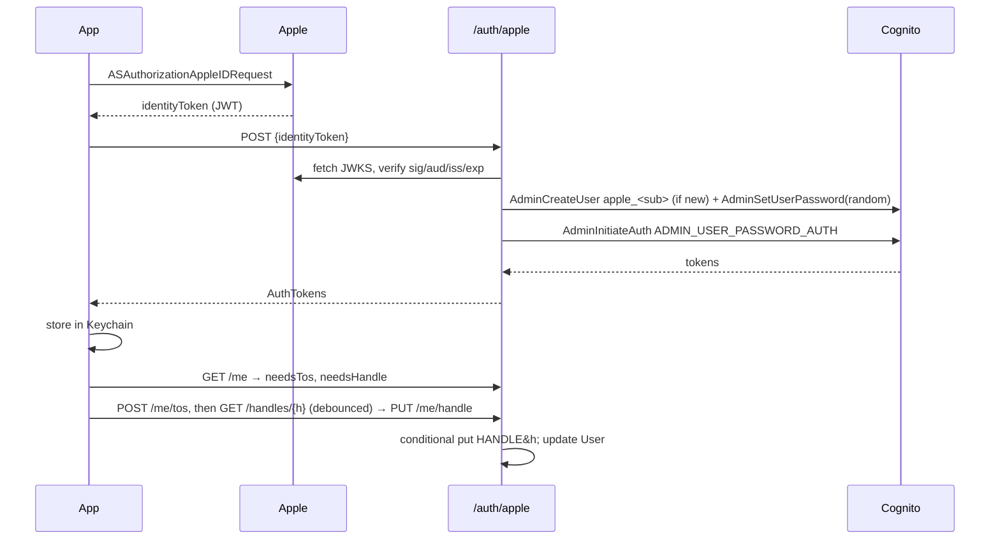
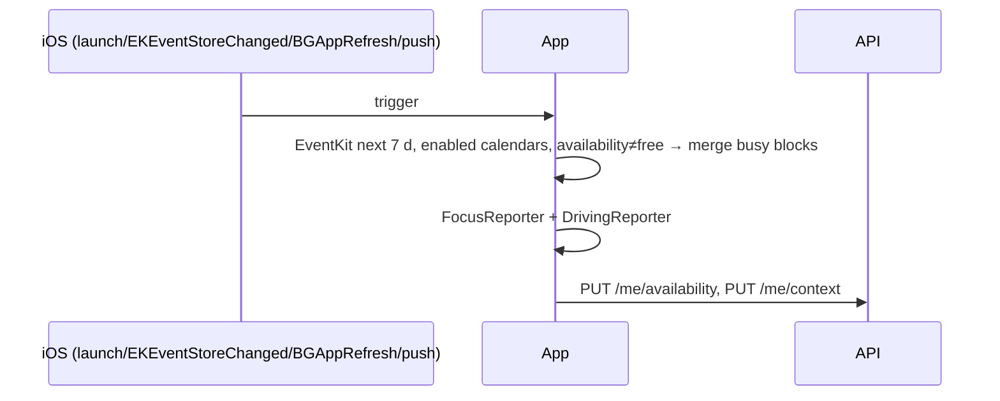
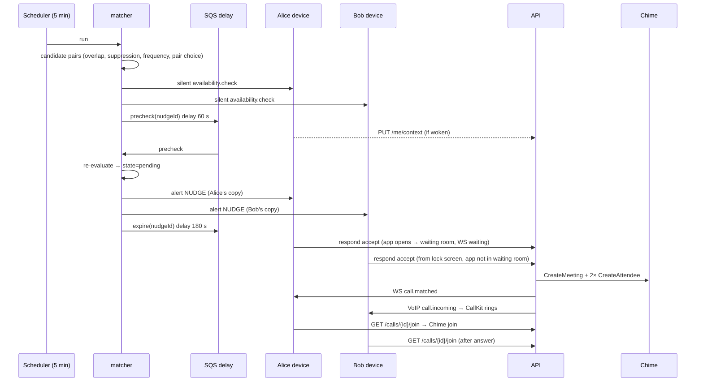
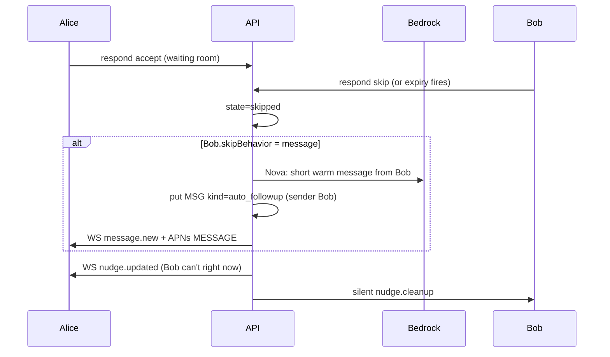
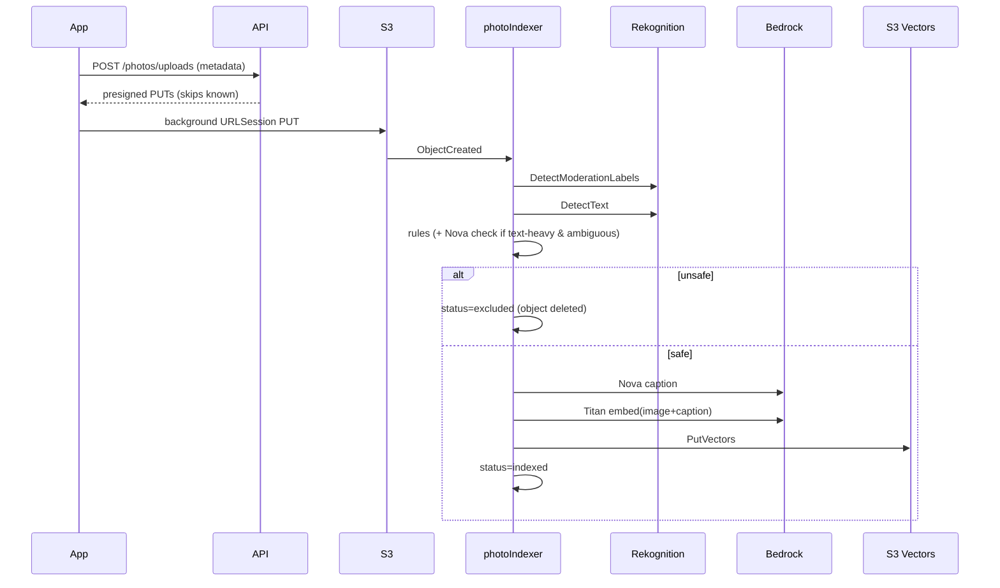
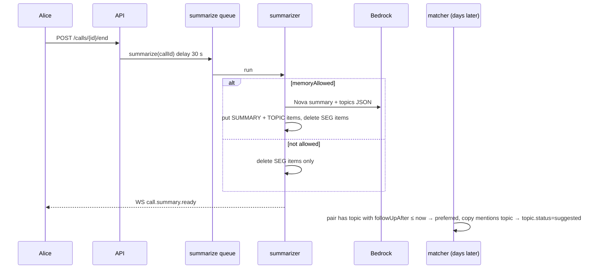

# Nudge — Specification

Status: v1 (2026-09-26). Source of truth: `prompts/01-claude-code-build.md`. Non-obvious choices live in `docs/DECISIONS.md`.

Verification tags used below: **[U]** unit test · **[I]** backend integration test against the deployed `dev` stage · **[B]** peer-bot test · **[E]** AI eval · **[S]** simulator screenshot/UI check · **[D]** manual device script (`docs/manual-tests/`) · **[2P]** two-person remote device script.

---

## 1. User stories

### 1.1 Accounts & friends (ACC)

**ACC-1 Sign in with Apple.** As a user, I want to sign in with Apple so I don't manage a password.
1. Given a fresh install, when I tap Sign in with Apple and complete the sheet, then the app receives Cognito tokens and shows the ToS screen. [D] [I: `/auth/apple` rejects a forged/expired token, accepts a verified one via stubbed JWKS in unit test [U]]
2. Given I signed in before, when I relaunch, then I land on Friends without signing in again (refresh token in Keychain). [S] [U]
3. Given the refresh token is revoked, when the app calls the API, then I'm returned to the sign-in screen. [U]

**ACC-2 Terms & consent.** As a user, I must accept the Terms before using the app so everyone on a call has consented.
1. Given `needsTos=true`, when I open the app, then every other screen is unreachable until I tap "I agree". [S] [I]
2. When I agree, then `tosVersion` and `tosAcceptedAt` are stored. [I]
3. Given the ToS version is bumped server-side, when I next open the app, then I must accept again. [I]

**ACC-3 Handle.** As a user, I want a unique handle like Instagram so friends can find me.
1. Given I type a handle, then within 400 ms of the last keystroke I see available / taken / invalid / reserved. [U validation] [I availability]
2. Handles are 3–20 chars of `a-z 0-9 _ .`, stored lowercase, can't start/end with `.` or contain `..`. [U]
3. Given two users claim the same handle concurrently, then exactly one succeeds (conditional put). [I]

**ACC-4 Profile.** As a user, I can set a display name and optional avatar. [I] [S]

**ACC-5 Phone (optional).** As a user, I can add and verify a phone number so friends can find me from contacts.
1. When I enter a number, then it is normalized to E.164 on device and an SMS code is sent. [U normalization] [D SMS]
2. When I enter the correct code, then my phone hash is claimed; a wrong code shows an inline error. [I with dev bypass code] [D]
3. I can skip this step and add it later in Settings. [S]

**ACC-6 Add by handle.** As a user, I can search handles and send a friend request. [I] [S]

**ACC-7 Add from contacts.** As a user, I can see which contacts use Nudge.
1. Numbers are normalized to E.164 and SHA-256 hashed on device; only hashes are sent. [U]
2. The server returns matching users and does not persist the uploaded hashes (verified by asserting no new items after the call). [I]

**ACC-8 Share link.** As a user, I can share `nudge://add/<handle>` plus text; opening it on a device with Nudge opens the Add screen prefilled. [U URL parsing] [D]

**ACC-9 Requests are mutual.** Given A requests B, when B accepts, then both see each other in Friends; if B had already requested A, A's request auto-accepts. Decline and cancel work. [I]

**ACC-10 Nicknames.** As a user, I can give a friend a private nickname; all my copy (nudges, calls, messages) uses it; they never see it. [I nudge copy uses the viewer's nickname] [U]

**ACC-11 Remove / block.** Removing deletes the friendship both ways. Blocking also prevents future requests and search results in both directions. [I]

**ACC-12 Delete account.** As a user, I can delete my account; all my items, S3 objects, vectors, friendships, pair data I'm part of, and my Cognito user are removed. [I asserts zero remaining items/objects]

### 1.2 Availability (AV)

**AV-1 Free/busy sync.** As a user, only my busy times (never titles) are shared.
1. Given calendar events, the uploaded payload contains only `{start,end}` for events with availability ≠ free on enabled calendars in the next 7 days, merged. [U]
2. Sync runs on launch/foreground, `EKEventStoreChanged`, `BGAppRefreshTask`, and when handling any notification action/silent push. [U triggers wired] [D]

**AV-2 Calendar selection.** I can turn individual calendars off; their events are then ignored on the next sync. [U] [S]

**AV-3 Focus & driving reports.** When the app runs, it reports `focus.isFocused` (if permitted) and `driving` (automotive, confidence ≥ medium, within 10 min), each timestamped. [U with mocked sources] [D]

**AV-4 Provider abstraction.** `CalendarProvider` protocol with `AppleCalendarProvider`; server has a `GoogleCalendarProvider` stub that throws `NotImplemented`. [U]

### 1.3 Nudges (NUD)

**NUD-1 Matching.** Given A and B are friends and both have no busy block from now for ≥ max(minWindowA, minWindowB), when the matcher runs, then a nudge is created for the pair. [U overlap engine] [I]

**NUD-2 Suppression.** No nudge if either user is in quiet hours (local tz), reported Focus < 15 min ago (respectFocus on), reported driving < 15 min ago (respectDriving on), is already in a nudge/call, has availability older than 48 h, or is over frequency limits. [U each rule] [I representative]

**NUD-3 Stale notice.** A user with stale availability gets at most one "Open Nudge to keep availability fresh" push per 7 days. [U] [I]

**NUD-4 Pre-check.** ~60 s before the nudge, both devices get a silent `availability.check`; the nudge is re-evaluated with any fresh reports and sent anyway if none arrive. [I] [D]

**NUD-5 Frequency.** Off/Low/Normal/High enforce daily cap, pair cooldown, and min gap (values in §3.6). "See this less often" steps down one level and counts as Skip. [U] [I]

**NUD-6 Pair choice.** When a user qualifies with several friends, the pair with a due follow-up topic wins, then the longest time since last call. [U]

**NUD-7 Copy.** Each participant sees their own nickname for the other, and minutes rounded down to 5 ("the next hour" if ≥ 60). With a due topic: "…Want to follow up about <topic>?" [U]

**NUD-8 Lock-screen delivery.** App closed: alert push with category `NUDGE`; long-press shows Accept / Skip / See this less often, and the content extension shows both avatars and the free window. [D] [S extension preview]

**NUD-9 In-app delivery.** App open: the system banner is suppressed and a custom banner drops from the top with Accept/Skip; swipe up dismisses (without responding); long-press → "See this less often" → toast with Undo (restores previous frequency). [S] [U banner state]

**NUD-10 States & expiry.** `precheck → pending → accepted_by_one → matched → in_call → ended` or `skipped`/`expired`/`cancelled`. A pending nudge expires 3 min after it was sent; expiry counts as skip. On any terminal state the other device's notification is removed by silent push. [U state machine] [I]

**NUD-11 Both accept.** When the second person accepts, a Chime meeting is created; participants on the waiting screen get `call.matched` over WebSocket; others get a VoIP push and CallKit rings. [I] [D] [2P]

**NUD-12 One skips.** When one accepts and the other skips/expires: if the skipper's `skipBehavior=message`, a short warm Nova-generated message from the skipper appears in the accepter's thread (push delivered); if `nothing`, nothing is sent. The accepter's waiting screen shows "<nickname> can't right now". [I] [E message tone smoke check]

**NUD-13 Call now.** From a friend's profile I can tap Call now; the friend gets a direct nudge ("Alan wants to call. Free?") with me pre-accepted; same flow as NUD-11/12. [I]

### 1.4 Calls (CALL)

**CALL-1 Video call.** 1:1 Chime call with remote video full-screen and a draggable self-view mini window that snaps to corners using momentum projection. [D] [U projection/snap math]
**CALL-2 CallKit/PushKit.** Incoming call rings via CallKit when the app is closed or locked; answering on lock screen starts audio, video starts on unlock. [D]
**CALL-3 Controls.** Mute, camera on/off, flip camera, end call; controls fade after 4 s idle. [S] [D]
**CALL-4 States.** Connecting, reconnecting, remote camera off, poor network banner. [S] [D]
**CALL-5 End.** Ending on one side ends for both; the call record gets `endedAt`; both see the summary screen. [I] [B]

### 1.5 Photo index (PHO)

**PHO-1 Last 30 days only.** Only photos taken in the last 30 days are uploaded (1024 px long edge JPEG), incrementally, via background URLSession, on library changes and `BGProcessingTask`. Hidden photos are never included; screenshots only if "Include screenshots". [U selection] [D]
**PHO-2 Safety.** Photos with moderation labels in the excluded set, or sensitive text (cards, bank/account, IDs, passwords/codes, medical), are never searchable and are counted as excluded. [U mocked Rekognition] [E fixture set 100% excluded]
**PHO-3 Caption + embedding.** Safe photos get a Nova caption and a Titan multimodal embedding stored in S3 Vectors with `userId`, `takenAt`, `place` metadata. [I]
**PHO-4 Expiry.** Photos older than 30 days are removed from S3 (lifecycle) and index (daily sweep). [U sweep] [I]
**PHO-5 Settings status.** Settings shows "N photos from the last 30 days indexed · M excluded for safety" and indexing progress. [I] [S]
**PHO-6 Delete all.** Deletes S3 objects, vectors, and items. [I]

### 1.6 In-call photo references (REF)

**REF-1 Own mic transcription.** Each device streams its own mic to Transcribe; final segments go over WebSocket with speaker = sender. [D] [B speech playback]
**REF-2 Detection.** The detector reads ~60 s of both speakers' segments and decides whether the latest speaker referenced something a photo would show. [E precision ≥ 0.85, recall ≥ 0.6]
**REF-3 Retrieval.** Search only the speaker's library with date/place filters; suggest only above the tuned threshold. [E top-1 ≥ 0.7, top-3 ≥ 0.9] [I]
**REF-4 Ask first.** A chip with thumbnail appears only on the speaker's screen with Show/✕ and auto-dismisses after 8 s. [S] [U]
**REF-5 Automatic.** The photo shows immediately with a 2 s Hide pill. [U] [S]
**REF-6 Off.** No suggestions are generated for that speaker. [I]
**REF-7 Synced swap.** offer → recipient fetches share URL → ready → both animate; sender proceeds after 1.5 s without ready. [U protocol state machine] [B] [2P]
**REF-8 Display rule.** Each device's mini window = other's active photo ?? my active photo ?? self view. [U full truth table] [B]
**REF-9 Queue.** Per-sender queue max 5 (oldest dropped); durations 6 s / 4.5 s / 3.5 s by queue length; dots show position; sender swipe → cancel. [U] [B]
**REF-10 Latency.** Utterance end → chip p50 ≤ 2.5 s, p95 ≤ 4 s; Show → visible both p95 ≤ 800 ms. Every stage timestamped. [I/B measured, reported]
**REF-11 Audit.** Every shown photo is logged under the call. [I]

### 1.7 Memory (MEM)

**MEM-1 Transcript retention.** Segments are stored with a 24 h TTL and deleted as soon as the summary is saved. [I]
**MEM-2 Summary & topics.** After a call, Nova produces a summary and topics `{title, aboutUserId, followUpAfter, summary}`. [E smoke] [I]
**MEM-3 Pair ownership.** Both see memories on the friend profile; either can delete any, which deletes for both. [I]
**MEM-4 Consent switch.** If either participant has memory off, nothing is stored for that call. [I]
**MEM-5 Follow-up copy.** Due topics feed nudge copy; a topic becomes `used` after a call following its suggestion; users can dismiss. [U] [I]
**MEM-6 Summary screen.** After the call: duration + "We'll remember" chips (deletable); auto-closes after 10 s. [S]

### 1.8 Messages (MSG)

**MSG-1 Thread per friend** with user text, auto follow-ups ("Sent automatically"), and system events ("Missed nudge · 3:40 PM", "Called · 12 min"). [I] [S]
**MSG-2 Push delivery** of new messages. [I push log] [D]

### 1.9 Settings (SET)

**SET-1 Nudges:** frequency, quiet hours, min window (5/10/15/30), respect Focus, respect driving, When I skip. [I persisted] [S]
**SET-2 Calendars:** per-calendar toggles; Google "Coming soon". [S]
**SET-3 Photos:** sharing mode, indexing toggle, status, include screenshots, delete all. [S] [I]
**SET-4 Memory:** on/off, all memories, delete all. [I] [S]
**SET-5 Account:** handle, name, avatar, phone, blocked users, sign out, delete account, Terms, Privacy. [S] [I]

### 1.10 Background (BG)

**BG-1** Every behavior in §4.6 is documented for foreground / background / terminated / force-quit and filled with observed device results. [D]

---

## 2. Verification methodology

| Layer | Tooling | Where | Runs |
|---|---|---|---|
| Pure logic (Swift) | Swift Testing, `swift test` on `ios/Packages/NudgeKit` | overlap mirror, display rule, queue timing, photo protocol, handle validation, phone normalization + hashing, busy-block extraction, URL parsing, snap projection | every commit / CI |
| Pure logic (backend) | Vitest (+ fast-check for property tests) | `backend/test/` — overlap engine, suppression rules, frequency limiter, nudge state machine, copy, pair choice, sensitive-text rules, moderation filter, handle rules, sweep | every commit / CI |
| Backend integration | Vitest against deployed `dev` stage (`backend/integ/`) | uses `/auth/dev` test users, `/dev/*` hooks (force matcher run, read push log, fast-forward nudge) — these routes only exist when `stage=dev` | per milestone |
| Peer bot | `tools/peer-bot` (Node + Puppeteer + Chime SDK JS, fake media) | two bots in one call exercise meeting join, `photo` data messages, display rule, queue, simultaneous share; bot can also stand in for the friend while a human uses the phone | per milestone ≥ M3 |
| AI evals | `evals/` Node scripts calling Bedrock with the same prompt modules as production | detector (≥120 labeled utterances), retrieval (~60 Nova-Canvas-generated images + queries), safety (benign fixtures rendered locally) | M4, M5, on prompt change |
| UI | `xcodebuild test` UI tests + screenshot capture script into `docs/screens/` | light/dark, largest Dynamic Type (AX5), Reduce Motion | M7 |
| Device / two-person | numbered scripts in `docs/manual-tests/` | CallKit, PushKit, camera, Focus, Core Motion, background, TestFlight between Alan and friend | needs Apple team |
| Cost | `aws ce get-cost-and-usage` gross vs net | progress reports | per milestone |

Latency instrumentation: every pipeline stage emits `{stage, callId, ms}` as a CloudWatch Embedded Metric (`Nudge/Latency`), and the client logs its own stage stamps to `POST /telemetry` in dev. p50/p95 are computed by `tools/latency-report`.

Honesty rule: a story is only "Done" when every tag on it has passed. Stories with [D]/[2P] tags that couldn't run are listed as "Built, awaiting device verification" in the progress reports.

---

## 3. Data models

### 3.1 DynamoDB (single table `Nudge-<stage>`, on-demand, TTL attr `ttl`)

| Entity | pk | sk | Attributes |
|---|---|---|---|
| User | `USER#<id>` | `PROFILE` | id, handle, displayName, avatarKey?, tz, settings (3.5), tosVersion?, tosAcceptedAt?, phoneHash?, frequencyBeforeLess?, recentNudgeAts[] (≤24 h), lastNudgeAt?, lastStaleNoticeAt?, activeNudgeId?, activeCallId?, createdAt, gsi1pk=`USERS`, gsi1sk=`<handle>` |
| Handle claim | `HANDLE#<handle>` | `CLAIM` | userId |
| Phone claim | `PHONE#<sha256>` | `CLAIM` | userId |
| Device | `USER#<id>` | `DEVICE#<deviceId>` | apnsToken?, voipToken?, apnsEnv (`sandbox`\|`production`), appVersion, lastSeenAt |
| Availability | `USER#<id>` | `AVAIL` | busyBlocks[{start,end}] (ISO, merged), syncedAt, source (`apple`), focus?{isFocused, at}, driving?{isDriving, at} |
| Friend request | `USER#<to>` | `FREQ#<from>` | from, to, createdAt, gsi1pk=`FREQOUT#<from>`, gsi1sk=`<to>` |
| Friendship | `USER#<a>` | `FRIEND#<b>` | nickname?, since, lastCallAt?, lastNudgeAt?, gsi1pk=`FRIENDSHIPS`, gsi1sk=`<pairKey>#<a>` |
| Block | `USER#<a>` | `BLOCK#<b>` | createdAt |
| Nudge | `NUDGE#<id>` | `META` | id, pairKey, participants[2], kind (`auto`\|`direct`), initiatorId?, window{start,end}, minutes, copyByUser{userId→{title,body}}, topicId?, state, responses{userId→`accepted`\|`skipped`\|`less`\|`expired`}, sentAt?, expiresAt?, callId?, createdAt, ttl (+30 d), gsi1pk=`PAIR#<pairKey>`, gsi1sk=`NUDGE#<createdAt>` |
| Call | `CALL#<id>` | `META` | id, nudgeId, pairKey, participants, chimeMeetingId, meeting (JSON), attendees{userId→attendee JSON}, startedAt, endedAt?, memoryAllowed, gsi1pk=`PAIR#<pairKey>`, gsi1sk=`CALL#<startedAt>` |
| Transcript seg | `CALL#<id>` | `SEG#<endMs 13-digit>#<userId>#<segId>` | userId, text, startMs, endMs, ttl (+24 h) |
| Photo share | `CALL#<id>` | `SHARE#<shareId>` | senderId, recipientId, photoId, createdAt, shownAt?, durationMs? |
| Suggestion | `CALL#<id>` | `SUGG#<id>` | userId, photoId, query, confidence, createdAt, stages{…ms}, ttl |
| Photo | `USER#<id>` | `PHOTO#<assetHash>` | assetHash, s3Key, takenAt, place?, isScreenshot, width, height, status (`pending`\|`indexed`\|`excluded`\|`failed`), exclusionReason?, labels[], caption?, vectorKey?, indexedAt?, ttl (takenAt + 31 d) |
| Topic | `PAIR#<pairKey>` | `TOPIC#<id>` | id, title, aboutUserId, summary, followUpAfter?, status (`open`\|`suggested`\|`used`\|`dismissed`), suggestedAt?, sourceCallId, createdAt |
| Call summary | `PAIR#<pairKey>` | `SUMMARY#<callId>` | callId, summary, durationSec, createdAt |
| Message | `PAIR#<pairKey>` | `MSG#<iso>#<id>` | id, senderId (or `system`), body, kind (`user`\|`auto_followup`\|`system`), systemEvent?{type,…}, createdAt, readBy[] |
| WS connection | `CONN#<connId>` | `META` | connectionId, userId, waitingNudgeId?, activeCallId?, connectedAt, ttl (+3 h), gsi1pk=`CONNUSER#<userId>`, gsi1sk=`<connId>` |
| Push log (dev only) | `PUSHLOG#<userId>` | `<iso>#<id>` | kind (`alert`\|`background`\|`voip`), payload, ttl (+1 d) |

`pairKey` = the two user ids sorted and joined with `_`. One GSI (`gsi1pk`, `gsi1sk`, all attributes projected).

Frequency counters are kept on the User item (`recentNudgeAts`, `lastNudgeAt`) and the Friendship items (`lastNudgeAt`, `lastCallAt`) — no scans of Nudge items are needed.

### 3.2 S3

Bucket `nudge-media-<stage>-<account>`: `photos/<userId>/<assetHash>.jpg` (lifecycle expire 31 d), `avatars/<userId>.jpg`, private, SSE-S3, CORS off, event notification on `photos/` → index pipeline.

### 3.3 S3 Vectors

Vector bucket `nudge-vectors-<stage>`, index `photos` (dimension 1024, cosine, float32). Key `<userId>#<assetHash>`. Filterable metadata: `userId` (string), `takenAt` (number, epoch seconds), `place` (string). Non-filterable: `caption`. Fallback (see DECISIONS) documented.

### 3.4 Swift client models (`NudgeKit/Models`)

All are `Codable, Sendable, Hashable` structs mirroring §3.7 DTOs: `UserDTO`, `Settings`, `PublicUser`, `Friend`, `FriendRequests`, `Nudge`, `NudgeState`, `CallJoin`, `Message`, `Topic`, `CallSummary`, `PhotoStatus`, `PhotoSuggestion`, `PhotoShareMessage`, `BusyBlock`, `ContextReport`, `ServerEvent` (enum over WS events).

Domain (pure) types: `DisplayState` (`.selfView`, `.mine(PhotoRef)`, `.other(PhotoRef)`), `PhotoQueue`, `PhotoShareSession` (protocol state machine), `HandleRule`, `PhoneHasher`, `BusyExtractor`, `SnapGeometry`.

### 3.5 Settings (server defaults)

```json
{
  "frequency": "normal",          // off | low | normal | high
  "quietStart": "00:00",          // local HH:mm
  "quietEnd": "08:00",
  "minWindowMin": 5,              // 5 | 10 | 15 | 30
  "respectFocus": true,
  "respectDriving": true,
  "skipBehavior": "message",      // message | nothing
  "photoMode": "ask",             // ask | auto | off
  "photoIndexing": true,
  "includeScreenshots": false,
  "memoryEnabled": true,
  "disabledCalendarIds": []       // client-only, not sent to server
}
```

### 3.6 Frequency levels

| Level | Daily cap / user | Pair cooldown | Min gap between any two nudges |
|---|---|---|---|
| Off | 0 | — | — |
| Low | 1 | 72 h | 6 h |
| Normal | 3 | 24 h | 2 h |
| High | 6 | 8 h | 45 min |

Pair cooldown is measured from the later of `lastNudgeAt` and `lastCallAt` on the pair. The pair uses the stricter of the two users' levels. "See this less often" sets `frequencyBeforeLess` (for Undo) and steps down one level (Low → Off is allowed? **No**: Low is the floor for "See less"; only Settings can choose Off).

### 3.7 API contracts

Base: `https://<api-id>.execute-api.us-east-1.amazonaws.com` (HTTP API). All requests except `/auth/*` carry `Authorization: Bearer <accessToken>`. Errors: `{ "error": { "code": "string", "message": "string" } }` with 4xx/5xx. Timestamps are ISO-8601 UTC strings.

**DTOs**

```ts
PublicUser   { id, handle, displayName, avatarUrl?: string }        // avatarUrl presigned 1 h
UserDTO      PublicUser & { settings: Settings, tz: string, phoneVerified: boolean,
                            tosVersion?: string, tosAcceptedAt?: string }
MeResponse   { user: UserDTO, needsTos: boolean, needsHandle: boolean, currentTosVersion: string }
Friend       { user: PublicUser, nickname?: string, since, lastCallAt?, freeNow: boolean, freeUntil?: string }
Relation     "none" | "requested" | "incoming" | "friends" | "blocked"
SearchResult PublicUser & { relation: Relation }
Nudge        { id, kind: "auto"|"direct", friend: PublicUser, nickname?: string, state: NudgeState,
               myResponse?: Response, theirResponse?: Response, window: {start,end}, minutes: number,
               title: string, body: string, topic?: {id,title}, expiresAt?: string, callId?: string }
NudgeState   "precheck"|"pending"|"accepted_by_one"|"matched"|"in_call"|"ended"|"skipped"|"expired"|"cancelled"
Response     "accepted"|"skipped"|"less"|"expired"
Message      { id, friendId, senderId: string /* userId or "system" */, body, kind: "user"|"auto_followup"|"system", createdAt }
Topic        { id, title, aboutUserId, summary, followUpAfter?: string, status }
CallSummary  { callId, summary, durationSec, createdAt, topics: Topic[] }
CallJoin     { callId, meeting: ChimeMeeting, attendee: ChimeAttendee, peer: PublicUser, peerNickname?: string,
               peerAttendeeId: string, memoryAllowed: boolean }
PhotoStatus  { indexed, excluded, pending, failed, lastIndexedAt?: string }
AuthTokens   { accessToken, idToken, refreshToken?, expiresIn, userId, isNew }
```

**Auth (no bearer)**

| Method & path | Body | Response |
|---|---|---|
| POST `/auth/apple` | `{ identityToken, fullName? }` | `AuthTokens` |
| POST `/auth/refresh` | `{ refreshToken, userId }` | `AuthTokens` (no refreshToken) |
| POST `/auth/dev` *(dev only)* | `{ username }` | `AuthTokens` |

**Me**

| Method & path | Body | Response |
|---|---|---|
| GET `/me` | — | `MeResponse` |
| PATCH `/me` | `{ displayName?, tz?, avatarKey?, settings?: Partial<Settings> }` | `MeResponse` |
| POST `/me/tos` | `{ version }` | `MeResponse` |
| GET `/handles/{handle}` | — | `{ available: boolean, reason?: "taken"\|"invalid"\|"reserved" }` |
| PUT `/me/handle` | `{ handle }` | `MeResponse` · 409 `handle_taken` · 400 `handle_invalid` |
| POST `/me/avatar` | — | `{ uploadUrl, avatarKey }` (PUT image/jpeg, then PATCH `/me`) |
| POST `/me/phone` | `{ phone }` (E.164) | `{ codeSent: true }` |
| POST `/me/phone/verify` | `{ code }` | `MeResponse` · 400 `code_mismatch` |
| DELETE `/me/phone` | — | `MeResponse` |
| POST `/me/devices` | `{ deviceId, apnsToken?, voipToken?, apnsEnv, appVersion }` | 204 |
| PUT `/me/availability` | `{ busyBlocks: [{start,end}], syncedAt, source: "apple", tz }` | 204 |
| PUT `/me/context` | `{ focus?: {isFocused, at}, driving?: {isDriving, at} }` | 204 |
| POST `/me/frequency/less` | — | `MeResponse` (steps down, stores undo) |
| POST `/me/frequency/undo` | — | `MeResponse` |
| DELETE `/me` | — | 202 |

**Friends**

| Method & path | Body | Response |
|---|---|---|
| GET `/users/search?q=` | — | `{ results: SearchResult[] }` (prefix match on handle, ≤ 20) |
| POST `/contacts/match` | `{ hashes: string[] }` (≤ 2000 hex SHA-256) | `{ results: SearchResult[] }` |
| GET `/friends` | — | `{ friends: Friend[] }` |
| GET `/friend-requests` | — | `{ incoming: {user: PublicUser, createdAt}[], outgoing: {…}[] }` |
| POST `/friend-requests` | `{ userId? , handle? }` | `{ relation: Relation }` |
| POST `/friend-requests/{userId}/accept` | — | `{ relation }` |
| POST `/friend-requests/{userId}/decline` | — | 204 |
| DELETE `/friend-requests/{userId}` | — | 204 (cancel outgoing) |
| PATCH `/friends/{userId}` | `{ nickname: string\|null }` | `Friend` |
| DELETE `/friends/{userId}` | — | 204 |
| GET `/blocks` | — | `{ users: PublicUser[] }` |
| POST `/blocks/{userId}` · DELETE `/blocks/{userId}` | — | 204 |
| GET `/friends/{userId}/memories` | — | `{ topics: Topic[], summaries: CallSummary[] }` |
| DELETE `/friends/{userId}/topics/{topicId}` | — | 204 (deletes for both) |
| POST `/friends/{userId}/topics/{topicId}/dismiss` | — | 204 |
| DELETE `/friends/{userId}/summaries/{callId}` | — | 204 |
| DELETE `/memories` | — | 204 (all pairs I'm in) |
| GET `/friends/{userId}/calls` | — | `{ calls: {callId, startedAt, durationSec}[] }` |
| POST `/friends/{userId}/call` | — | `Nudge` (direct, me pre-accepted) |

**Messages**

| Method & path | Body | Response |
|---|---|---|
| GET `/conversations` | — | `{ conversations: {friend: PublicUser, nickname?, lastMessage?: Message, unread: number}[] }` |
| GET `/friends/{userId}/messages?before=` | — | `{ messages: Message[] }` (newest first, 50) |
| POST `/friends/{userId}/messages` | `{ body }` (1–1000 chars) | `Message` |
| POST `/friends/{userId}/messages/read` | — | 204 |

**Nudges & calls**

| Method & path | Body | Response |
|---|---|---|
| GET `/nudges/active` | — | `{ nudge: Nudge \| null }` |
| GET `/nudges/{id}` | — | `Nudge` |
| POST `/nudges/{id}/respond` | `{ action: "accept"\|"skip"\|"less" }` | `Nudge` |
| POST `/nudges/{id}/cancel` | — | `Nudge` (accepter leaves waiting room) |
| GET `/calls/{id}/join` | — | `CallJoin` |
| POST `/calls/{id}/end` | — | 204 |
| GET `/calls/{id}/summary` | — | `CallSummary` · 202 `{pending:true}` |
| POST `/calls/{id}/shares` | `{ photoId, suggestionId? }` | `{ shareId, thumbUrl }` |
| POST `/calls/{id}/suggestions/{suggestionId}/feedback` | `{ outcome: "dismissed" }` | 204 |
| GET `/calls/{id}/shares/{shareId}` | — | `{ url, expiresAt }` (recipient only; presigned 5 min) |
| POST `/calls/{id}/shares/{shareId}/shown` | `{ shownAt, durationMs }` | 204 |

**Photos & transcription**

| Method & path | Body | Response |
|---|---|---|
| POST `/photos/uploads` | `{ items: [{assetHash, takenAt, place?, isScreenshot, width, height}] }` (≤ 50) | `{ uploads: [{assetHash, uploadUrl}], skipped: string[] }` |
| GET `/photos/status` | — | `PhotoStatus` |
| DELETE `/photos/{assetHash}` · DELETE `/photos` | — | 204 |
| GET `/transcribe/config` | — | `{ identityPoolId, region, userPoolProviderName }` |
| POST `/telemetry` *(dev only)* | `{ events: [{name, ms, callId?}] }` | 204 |

**Dev-only hooks** (`stage=dev`): POST `/dev/matcher/run {now?}`, GET `/dev/pushes/{userId}`, POST `/dev/nudges/{id}/expire`, POST `/dev/calls/{id}/summarize`, POST `/dev/phone/verify {userId, phone}` (bypasses SMS).

### 3.8 WebSocket

URL `wss://<ws-id>.execute-api.us-east-1.amazonaws.com/<stage>?token=<accessToken>`. Route selection: `$request.body.action`.

Client → server:
```json
{ "action": "ping" }
{ "action": "waiting", "nudgeId": "n_…" }               // nudgeId null = left waiting room
{ "action": "transcript", "callId": "c_…", "segId": "uuid", "text": "…", "startMs": 0, "endMs": 1234, "clientTs": 1700000000000 }
```
Server → client (`type` discriminator):
```json
{ "type": "nudge.updated", "nudge": Nudge }
{ "type": "call.matched", "callId": "c_…", "nudgeId": "n_…" }
{ "type": "call.ended", "callId": "c_…" }
{ "type": "message.new", "friendId": "u_…", "message": Message }
{ "type": "friend.request", "user": PublicUser }
{ "type": "friend.accepted", "user": PublicUser }
{ "type": "photo.suggestion", "callId", "suggestionId", "photoId", "thumbUrl", "query", "confidence", "auto": false }
{ "type": "call.summary.ready", "callId", "friendId" }
{ "type": "pong" }
```

### 3.9 APNs payloads

Alert nudge (topic `<bundleId>`, push-type `alert`, priority 10, `apns-expiration` = expiresAt):
```json
{ "aps": { "alert": { "title": "Mom is free too", "body": "You and Mom are both free for the next 10 minutes. Call?" },
           "category": "NUDGE", "sound": "default", "thread-id": "nudge", "mutable-content": 1,
           "interruption-level": "active" },
  "type": "nudge", "nudgeId": "n_…", "friendId": "u_…", "friendName": "Mom",
  "windowStart": "…", "windowEnd": "…", "minutes": 10, "avatarUrl": "https://…" }
```
Background (push-type `background`, priority 5): `{ "aps": {"content-available": 1}, "type": "availability.check" | "nudge.cleanup" | "calendar.sync", "nudgeId"? }`

VoIP (topic `<bundleId>.voip`, push-type `voip`): `{ "type": "call.incoming", "callId", "nudgeId", "callerId", "callerName", "hasVideo": true }`

Message: `{ "aps": {"alert": {"title": "Mom", "body": "…"}, "category": "MESSAGE", "thread-id": "msg-<friendId>", "sound": "default"}, "type": "message.new", "friendId" }`

Others (alerts): `friend.request`, `friend.accepted`, `availability.stale` ("Open Nudge to keep your availability fresh").

Notification categories: `NUDGE` actions `ACCEPT` (foreground), `SKIP`, `LESS`; `MESSAGE` (none).

### 3.10 Chime data messages (topic `photo`, JSON ≤ 2 KB, lifetime 10 s)

```json
{ "v": 1, "type": "offer",  "seq": 7, "shareId": "s_…", "senderId": "u_…", "durationMs": 6000, "queueIndex": 0, "queueLength": 1 }
{ "v": 1, "type": "ready",  "seq": 7, "shareId": "s_…", "senderId": "<recipient>" }
{ "v": 1, "type": "end",    "seq": 7, "shareId": "s_…", "senderId": "u_…" }
{ "v": 1, "type": "cancel", "seq": 7, "shareId": "s_…", "senderId": "u_…" }
```
Order by Chime `timestampMs`, tiebreak `senderId`. Durations: queueLength 1 → 6000, 2 → 4500, ≥ 3 → 3500. The photo is shown from the `ready` moment for `durationMs` on both ends.

---

## 4. Architecture

### 4.1 Repo layout
```
backend/            CDK app (bin/, lib/), Lambda sources (src/), unit tests (test/), integration tests (integ/)
ios/                project.yml (XcodeGen) → Nudge.xcodeproj
  App/              SwiftUI app target (screens, app delegate, CallKit/PushKit glue)
  Extensions/       NotificationContent, NotificationService
  Packages/NudgeKit Swift package: DesignSystem, Models, Networking, Auth, Friends, Availability, Nudges,
                    Calls, Transcription, PhotoIndex, PhotoShare, Messages, Memory, Settings, BackgroundTasks
  Config/           Signing.xcconfig (TEAM_ID, BUNDLE_ID), Env.xcconfig (API URLs)
tools/peer-bot      Node + Puppeteer + Chime SDK JS
tools/latency-report
evals/              detector/, retrieval/, safety/
docs/               SPEC, DECISIONS, APPLE_SETUP, progress/, manual-tests/, screens/
```

### 4.2 iOS modules (library targets of the `NudgeKit` package)

| Module | Responsibility | Depends on |
|---|---|---|
| DesignSystem | tokens (Appendix A), type styles, springs, components (buttons, avatar, rows, chips, banner, toast) | — |
| Models | DTOs (§3.7), pure domain types | — |
| Networking | `APIClient` (async, retries, auth refresh), `EventSocket` (URLSessionWebSocketTask, backoff reconnect, ping 30 s), `Endpoints` | Models |
| Auth | `SessionStore` (@Observable), Keychain token storage, Sign in with Apple coordinator | Networking |
| Friends | search, contacts matching (`PhoneHasher` with PhoneNumberKit), requests, nicknames, share link | Networking |
| Availability | `CalendarProvider`, `AppleCalendarProvider`, `BusyExtractor`, `FocusReporter`, `DrivingReporter`, `AvailabilitySync` | Networking |
| Nudges | notification categories, `NudgeCenter` (@Observable), in-app banner, waiting room model | Networking, DesignSystem |
| Calls | `CallController` (Chime session), `CallKitProvider`, `VoIPPushHandler`, `SnapGeometry` | Networking, PhotoShare, Transcription |
| Transcription | mic tap → 16 kHz PCM, `TranscribeStreamClient` (SigV4 presigned WebSocket + event-stream codec), Cognito identity credentials | Networking |
| PhotoIndex | `PhotoSelector` (30 days, hidden/screenshot rules), resizer, background uploader, `PHPhotoLibraryChangeObserver` | Networking |
| PhotoShare | `DisplayRule`, `PhotoQueue`, `PhotoShareSession` state machine, `PhotoShareMessage` codec | Models |
| Messages | conversations, thread | Networking |
| Memory | memories per friend, summary screen model | Networking |
| Settings | settings model bound to `PATCH /me` | Networking |
| BackgroundTasks | `BGAppRefreshTask` (`app.nudge.refresh`), `BGProcessingTask` (`app.nudge.photos`) registration and scheduling | Availability, PhotoIndex |

App target: `NudgeApp`, `AppDelegate` (APNs + PushKit registration, notification delegate), root router (Auth → ToS → Handle → Onboarding → Tabs), all screens. SwiftData cache (`CachedFriend`, `CachedMessage`, `CachedTopic`) used for instant launch; server is the source of truth.

Extensions share an App Group `group.<bundleId>` (tokens for the service extension to fetch avatars; cached nicknames).

### 4.3 Backend services

| Component | Detail |
|---|---|
| Cognito user pool | username = `apple_<sub>` or `dev_<name>`; `phone_number` attribute; no hosted UI. Tokens minted server-side after Apple identity-token verification (see DECISIONS D-3). |
| Cognito identity pool | authenticated role allows only `transcribe:StartStreamTranscription` |
| HTTP API | Cognito JWT authorizer (access token, `client_id` claim) · one Lambda per route group (`auth`, `me`, `friends`, `messages`, `nudges`, `calls`, `photos`, `dev`) |
| WebSocket API | `$connect` (verifies JWT from `token` query param), `$disconnect`, `waiting`, `transcript`, `ping` |
| DynamoDB | single table (§3.1), on-demand, PITR off (cost), TTL on |
| S3 | media bucket (§3.2) with lifecycle + event → `photoIndexer` |
| S3 Vectors | vector bucket + index (§3.3) |
| SQS | `nudge-delay` queue (DelaySeconds per message: 60 s pre-check, 180 s expiry), `summarize` queue (30 s delay) |
| EventBridge Scheduler | `matcher` every 5 min, `photoSweep` daily 04:00 UTC |
| Bedrock | Nova Lite (`amazon.nova-lite-v1:0`) for detector, captions, summaries, follow-up message, sensitive-text check; Titan Multimodal Embeddings (`amazon.titan-embed-image-v1`, 1024 dims) |
| Rekognition | DetectModerationLabels, DetectText |
| Chime SDK Meetings | CreateMeeting / CreateAttendee / DeleteMeeting, region us-east-1 |
| APNs | HTTP/2 from Lambda (Node `http2`), ES256 JWT from the .p8 in SSM; host chosen per device `apnsEnv`; if SSM key missing → push is written to the push log only (dev) and logged |
| SSM | `/nudge/<stage>/apns/{keyId,teamId,p8,bundleId}`, `/nudge/<stage>/apple/{bundleId}` |
| Budgets | `nudge-net-cost` monthly, net-after-credits > $1 → email |

### 4.4 Sequence diagrams

**Sign-in and handle**


**Add friend from contacts**
```mermaid
sequenceDiagram
  participant App
  participant API
  participant DB as DynamoDB
  App->>App: CNContactStore → E.164 → SHA-256
  App->>API: POST /contacts/match {hashes}
  API->>DB: BatchGet PHONE#<hash>
  API-->>App: results (hashes not stored)
  App->>API: POST /friend-requests {userId}
  API->>DB: put FREQ; push friend.request to target (WS + APNs)
  Note over App,API: target accepts → FRIEND items both ways, friend.accepted to requester
```

**Calendar sync**


**Nudge match → both accept → call**


**Nudge → one skips → follow-up**


**Photo index pipeline**


**In-call reference → suggestion → show (incl. simultaneous)**
```mermaid
sequenceDiagram
  participant A as Alice
  participant WS as WS transcript route
  participant BR as Bedrock
  participant V as S3 Vectors
  participant B as Bob
  A->>WS: transcript segment (final)
  WS->>WS: store SEG, load last 60 s both speakers
  WS->>BR: Nova detector → {isReference, query, dateHint, placeHint}
  WS->>BR: Titan embed(query)
  WS->>V: QueryVectors filter userId=Alice (+date)
  WS-->>A: photo.suggestion (ask) / auto
  A->>A: tap Show → POST /calls/{id}/shares → shareId
  A->>B: Chime data offer{shareId, durationMs}
  B->>B: GET share URL, download
  B->>A: Chime data ready
  Note over A,B: both start swap at ready; display rule: other ?? mine ?? self
  B->>A: (simultaneous) Bob offer → Alice ready
  Note over A,B: Alice's mini = Bob's photo, Bob's mini = Alice's photo
```

**End of call → memory → follow-up nudge**


### 4.5 Latency budget (REF-10)

| Stage | Target |
|---|---|
| Transcribe final after speech end | ~700 ms |
| WS send + Lambda warm | 100 ms |
| DynamoDB context load | 30 ms |
| Nova Lite detector | 700 ms |
| Titan text embed | 250 ms |
| S3 Vectors query | 150 ms |
| presign + WS push | 50 ms |
| **Total** | **≈ 2.0 s p50** |
| Show → share API | 150 ms |
| offer → recipient fetch URL + download (~150 KB) | 400 ms |
| ready → sender | 100 ms |
| **Total** | **≈ 650 ms** |

### 4.6 Background execution

| Behavior | Foreground | Background (suspended) | Terminated by system | Force-quit by user |
|---|---|---|---|---|
| Nudge alert + actions | custom in-app banner | system banner, actions work | system banner; Skip/Less launch app in background to call API | banner shows; **Skip/Less still delivered** (action responses launch the app) |
| Silent `availability.check` | handled | woken, reports context | launched in background (budgeted) | **not delivered** (iOS rule) |
| BGAppRefresh calendar sync | n/a | opportunistic | opportunistic | **never** until next launch |
| VoIP incoming call | CallKit/in-app | CallKit rings | CallKit rings (app launched) | CallKit rings (PushKit relaunches) |
| Message push | WS event + no banner in thread | banner | banner | banner |
| Photo upload | foreground URLSession | background URLSession continues | continues (system-owned) | cancelled |
| EKEventStoreChanged | handled | on resume | on next launch | on next launch |

Observed results get filled into `docs/manual-tests/background-matrix.md` during M7 device testing.
